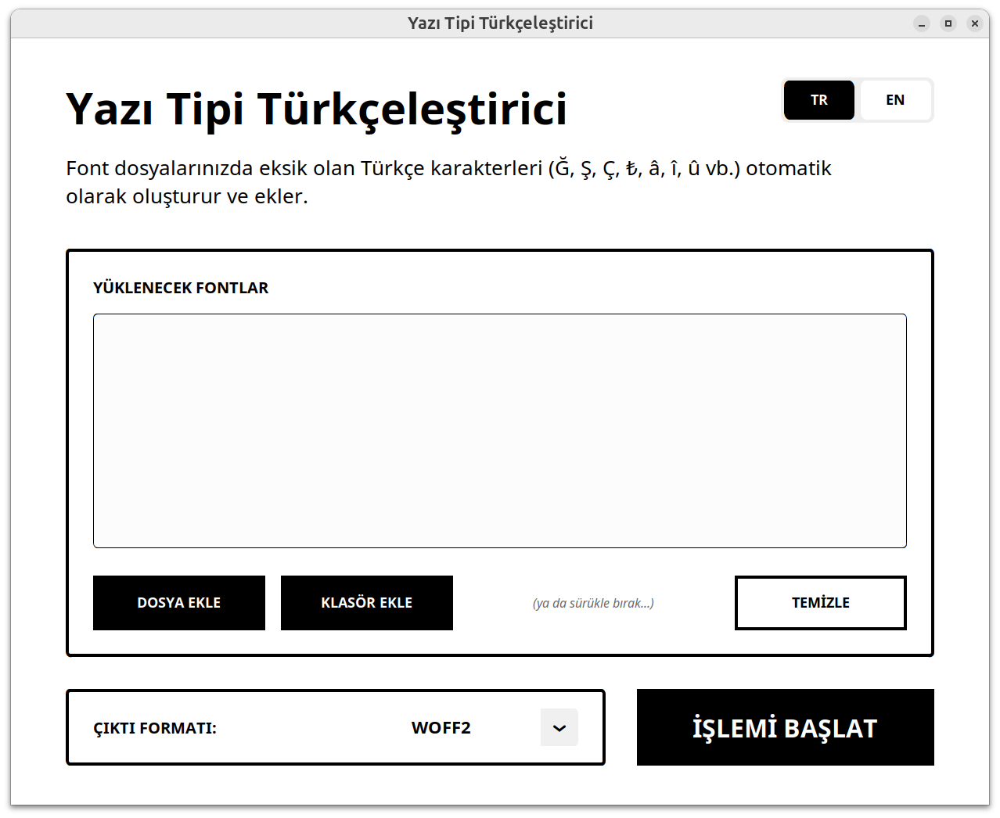

# ⚡ FONT TURKICIZER

**High-precision localization for modern typography.**

> *"I assess the power of a will by how much resistance, pain, torture it endures and knows how to turn to its advantage."*  
> — Friedrich Nietzsche



**Font Turkicizer** is a high-performance typography engine designed to eliminate repetitive digital labor. No bloated frameworks. No unnecessary dependencies. Just a tool that works.

<details>
<summary>🇹🇷 Türkçesi için Tıkla!</summary>

## ⚡ YAZI TİPİ TÜRKÇELEŞTİRİCİ

**Modern tipografi için yüksek hassasiyetli yerelleştirme motoru.**

> *"Bir iradenin gücünü, ne kadar dirence, acıya, işkenceye dayanabildiğine ve bunları kendi yararına çevirmeyi bildiğine göre değerlendiririm."*  
> — Friedrich Nietzsche

**Font Turkicizer**, tekrarlayan dijital işleri ortadan kaldırmak için tasarlanmış yüksek performanslı bir tipografi aracıdır. Şişirilmiş framework yok. Gereksiz bağımlılık yok. Sadece çalışan bir motor.

---

## ✨ Özellikler

*   **Otomatik Karakter Oluşturma:** Eksik Türkçe karakterleri (`Ğ, ğ, Ş, ş, İ, ı, Ç, ç, Ö, ö, Ü, ü`) font metriklerine göre sentezler.
*   **Şapkalı Sesliler:** Türkçe yerelleştirme için gereken tüm şapkalı karakterleri (`Â, â, Î, î, Û, û, Ô, ô, Ê, ê`) otomatik olarak ekler.
*   **Resmi Türk Lirası Simgesi:** Mevcut font tasarımına uygun şekilde Türk Lirası simgesini (`₺` - `U+20BA`) inşa eder.
*   **Endüstriyel Sürükle-Bırak:** Dosyaları (`.ttf`, `.otf`, `.woff`, `.woff2`) veya klasörleri saniyeler içinde işleyin.
*   **Çift Dil Desteği:** Türkçe ve İngilizce arayüz seçeneği.
*   **Web Hazır Export:** WOFF2, TTF, OTF ve WOFF formatlarında optimize edilmiş çıktı sağlar.

---

## 🚀 Kullanım

```bash
pip install -r requirements.txt
python3 main.py
```

---

## 👤 Geliştirici

**[Mete Avcı](https://github.com/MeteAvci)** tarafından **AI Final Boss aka ÇeteGPT** ile birlikte geliştirildi

[Me the Tech](https://methetech.com)'in bir parçası – AI & otomasyon stüdyosu

---

Yalnızca kişisel ve yasal kullanım içindir. Telif haklı yazı tiplerinin izinsiz kullanımından veya bu aracın kötüye kullanımından doğacak her türlü yasal sorumluluk kullanıcıya aittir. Geliştirici hiçbir sorumluluk kabul etmez.

</details>

---

## ✨ Features

*   **Automated Glyph Generation:** Synthesizes missing Turkish characters (`Ğ, ğ, Ş, ş, İ, ı, Ç, ç, Ö, ö, Ü, ü`) based on font metrics.
*   **Circumflex Vowel Support:** Automatically adds all accented characters required for Turkish localization (`Â, â, Î, î, Û, û, Ô, ô, Ê, ê`).
*   **Official Turkish Lira Symbol:** Constructs the Turkish Lira symbol (`₺` - `U+20BA`) matching the source font's aesthetic.
*   **Industrial Drag & Drop:** Effortlessly process individual files (`.ttf`, `.otf`, `.woff`, `.woff2`) or entire directories.
*   **Dual-Language Interface:** Full support for Turkish and English localized controls.
*   **Web-Ready Export:** Optimized output for WOFF2, TTF, OTF, and WOFF formats.

---

## 🛠️ Installation & Usage

**1. Clone & Install:**
```bash
git clone https://github.com/methetech/font-turkicizer.git
cd font-turkicizer
pip install -r requirements.txt
```

**2. Run:**
```bash
python3 main.py
```

---

## 🧠 Technical Architecture

Font Turkicizer leverages `fontTools` to perform non-destructive composite glyph creation. It analyzes the font's geometry to locate base characters and diacritics, calculates optimal horizontal metrics, and registers new characters in the mapping tables. This ensures that the generated characters maintain the exact weight and spacing of the original font family.

---

## 👤 Author

Developed by [Mete Avcı](https://github.com/MeteAvci)**.

[](https://x.com/HorizonHacker)
[](https://linkedin.com/in/meteee)

---

## ⚠️ Disclaimer

This tool is intended for legal and personal use only. The user bears full legal responsibility for any copyright infringement or misuse of licensed font assets. The developer accepts no liability for any legal issues or damages arising from the use of this tool.

---

## License

[MIT](./LICENSE)